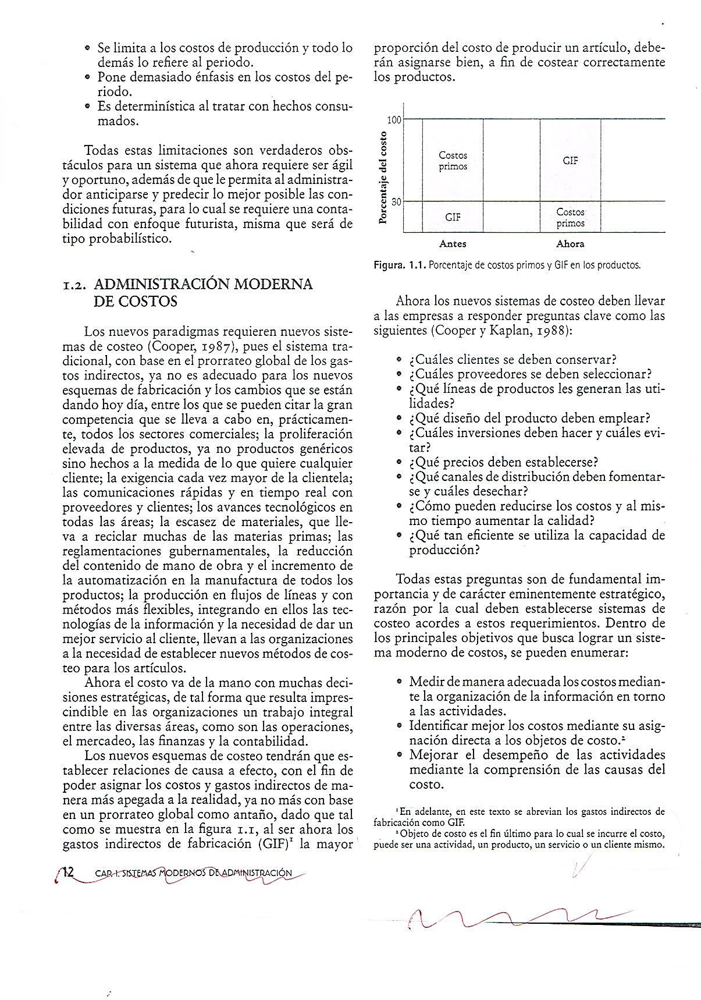

# MANUAL-CONTABILIDAD GERENCIAL III 2026- I-II

ACREDITADA POR
ACCREDITATION COUNCIL FOR BUSINESS SCHOOLS AND PROGRAMS (ACBSP),
EUROPEAN COUNCIL FOR BUSINESS EDUCATION (ECBE),
AXENCIA PARA A CALIDADE DO SISTEMA UNIVERSITARIO DE GALICIA (ACSUG) Y
SISTEMA NACIONAL DE EVALUACIÓN, ACREDITACIÓN Y CERTIFICACIÓN DE LA CALIDAD EDUCATIVA (SINEACE)
ESCUELA PROFESIONAL DE CONTABILIDAD Y FINANZAS
MANUAL:
CONTABILIDAD GERENCIAL III
CICLO VII
SEMESTRE ACADÉMICO 2026 I-II
Material didáctico para uso exclusivo de clase.
LIMA - PERÚ
UNIVERSIDAD DE SAN MARTIN DE PORRES
RECTOR
DR. JOSÉ ANTONIO CHANG ESCOBEDO
VICE RECTOR
DR. RAÚL EDUARDO BAO GARCÍA
FACULTAD DE CIENCIAS CONTABLES, ECONÓMICAS Y FINANCIERAS
DECANO
DR. JUAN AMADEO ALVA GÓMEZ
DIRECTOR DE LA ESCUELA PROFESIONAL DE CONTABILIDAD Y FINANZAS
DR. SABINO TALLA RAMOS
DIRECTOR ESCUELA DE ECONOMÍA
DIRECTOR DEL DEPARTAMENTO ACADÉMICO DE CONTABILIDAD, ECONOMÍA Y FINANZAS
DR. LUIS HUMBERTO LUDEÑA SALDAÑA
DIRECTOR DE LA SECCIÓN DE POSTGRADO
DR. CRISTIAN ALBERTO YONG CASTAÑEDA
DIRECTOR DE LA OFICINA DE GRADOS Y TÍTULOS
DIRECTOR DE LA OFICINA DE PROYECCIÓN Y EXTENSIÓN UNIVERSITARIA
DR. ALONSO ROJAS MENDOZA
DIRECTOR DEL INSTITUTO DE INVESTIGACIÓN
DR. PABLO AUGUSTO LAVADO DE LA PUENTE
SECRETARIO DE FACULTAD
MG. JUAN CARLOS ZEVALLOS ASTENGO
JEFE DE LA OFICINA DE REGISTROS ACADÉMICOS
JEFE DE LA OFICINA DE BIENESTAR UNIVERSITARIO
JEFE DE LA OFICINA DE ADMINISTRACIÓN
SR. ROSENDO, MONTES HIJAR
JEFE DE LA UNIDAD DE ACREDITACIÓN Y CALIDAD DE LA FACULTAD DE CIENCIAS CONTABLES, ECONÓMICAS Y FINANCIERAS
DR. LUIS HUMBERTO LUDEÑA SALDAÑA
COORDINADOR ACADÉMICO DE LA ESCUELA PROFESIONAL DE CONTABILIDAD Y FINANZAS
TURNO MAÑANA
DRA. MARÍA EUGENIA, VÁSQUEZ GIL
COORDINADOR ACADÉMICO DE LA ESCUELA PROFESIONAL DE CONTABILIDAD Y FINANZAS
TURNO NOCHE
DR. JAVIER EDILBERTO FERNANDEZ DELGADO
COORDINADOR DE LA SECCIÓN DE POSTGRADO DE CONTABILIDAD Y FINANZAS
COORDINADOR ACADÉMICO DE LA ESCUELA PROFESIONAL DE ECONOMÍA
TURNO MAÑANA Y NOCHE
DR. JOSÉ PAREDES SOLDEVILLA
INTRODUCCIÓN
La Universidad de San Martín de Porres, en estos últimos años está empeñada en realizar importantes innovaciones en la concepción y práctica educativa con el propósito de ofrecer a sus alumnos una formación profesional competitiva, globalizada y transversal, que haga posible su ingreso con éxito al mundo laboral, desempeñándose con eficacia y eficiencia en las funciones profesionales que les tocará asumir,
El marco de referencia está dado por los cambios significativos de la sociedad contemporánea, expresados en la globalización de los intercambios, los nuevos paradigmas del conocimiento, de la educación y la pedagogía, así como los retos del mundo laboral.
Para cumplir con el propósito señalado, la Facultad de Ciencias Contables, Económicas y Financieras, ha asumido la misión de brindar una formación integral, profesional y analítica, basada en el cultivo de valores, pero con enfoques integrales en la solución de problemas
Constituye nuestro compromiso formar líderes con capacidad de formular propuestas innovadoras que impulsen la creación de una nueva realidad universitaria, a base de los siguientes aprendizajes: aprender ser, aprender a conocer, aprender a hacer y aprender a convivir.
Uno de las medidas para el logro de nuestros propósitos, constituyen los Manuales de Autoeducación, elaborados como materiales educativos que deben servir para afianzar conocimientos, "desarrollar habilidades y destrezas”, así como para orientar el auto aprendizaje permanente.
El material brindado se orienta a facilitar la lectura comprensiva y critica, con el objetivo de ampliar conocimientos en otras fuentes, crear hábitos y actitudes para el procesamiento de información, adquisición y generación de aprendizaje significativo.
El presente Manual de Contabilidad Gerencial III, constituye material de apoyo al desarrollo del curso del mismo nombre, y está organizado en cuatro unidades didácticas:
Unidad I: Costos basados en actividades o Costeo ABC: características y aplicaciones
Unidad II: Gerencia basada en actividades ABM: dimensiones y reportes de actividades.
Unidad III: El presupuesto flexible: herramienta de mejora continua y medición del desempeño.
Unidad IV: Costos e ingresos relevantes en la toma de decisiones administrativas.
Cada unidad propuesta en base a competencias, en lo posible busca una secuencia e integración de conceptos de tal manera que sea de utilidad para el estudiante. Cada tema tiene una estructura modular que, además del desarrollo del contenido incorpora una propuesta de actividades aplicativas o ejercicios y de auto evaluación. Al final de cada tema se presentan además las referencias bibliográficas que han servido como fuente para la elaboración de los contenidos del curso de Contabilidad Gerencial III.
UNIDAD I: SISTEMAS MODERNOS DE ADMINISTRACIÓN DE COSTOS
EL COSTEO BASADO EN ACTIVIDADES (Activity Based Costing)
Los nuevos enfoques de la contabilidad han llevado de la mano a las organizaciones hacia modernos sistemas de costeo de los productos, con el fin de establecer sus precios de manera justa y les permita competir con mayores opciones de ventaja en mercados cada vez más difíciles y con mayor número de artículos hechos a la medida de lo que quiere el cliente.
La contabilidad financiera tradicional está dando paso a una nueva contabilidad gerencial enfocada en tomar decisiones para el futuro y no simplemente reportar el pasado (Ramírez Padilla, 2001); estableciendo reportes detallados y no globales de la actuación, basados en estimaciones y no siempre en números precisos, con términos tanto monetarios como no monetarios, estableciendo una actuación dinámica para la administración y no estática como sucedía en el caso de la contabilidad tradicional y tomando en cuenta indicadores del desempeño tanto financieros como no financieros.
Por esto, la información contable ya no se dirige sólo a los propietarios y accionistas de las empresas y corporaciones, sino que debe estar disponible para los gobiernos y el público en general de manera ágil, veraz, oportuna y transparente, que los lleve a tomar mejores decisiones, tanto a nivel interno como externo en las organizaciones, a modo de alinear la visión con la operación de la empresa, para su mejor funcionamiento y mayor eficacia y eficiencia.
LOS SISTEMAS TRADICIONALES DE COSTEO
La contabilidad de costos tradicional, ha tratado siempre de separar estos dos conceptos – costos y gastos - a tal punto de distribuir a los productos fabricados o servicios prestados únicamente los costos. Los gastos no se relacionan para nada con el producto terminado.
Los sistemas tradicionales han ido evidenciando debilidades o limitantes por muchas razones. Entre las principales limitantes de la contabilidad tradicional figuran las siguientes:
Se enfoca en la valuación financiera de los inventarios, no en su verdadero costo.
Los reportes que presenta son posteriores a los sucesos y no inmediatos.
Usa métodos arbitrarios o inapropiados de asignación de costos como el prorrateo global.
Por la manera de asignar costos indirectos, genera subsidios cruzados.
Se limita a los costos de producción y todo lo demás lo refiere al periodo.
Todas estas limitaciones son verdaderos obstáculos para un sistema que ahora requiere ser ágil y oportuno, además de que le permita al administrador anticiparse y predecir lo mejor posible las condiciones futuras, para lo cual se requiere una contabilidad con enfoque futurista, misma que será de tipo probabilístico.
ASIGNACION DE COSTOS EN EL MODELO TRADICIONAL
El sistema tradicional costea los productos basado en la asignación de dos grupos de costos: directos e indirectos. Los costos indirectos son aplicados usando una base de asignación como las horas de mano de obra directa, suponiendo una relación o vinculación entre MOD y CIF.
1.3.  ADMINISTRACIÓN MODERNA DE COSTOS
Los nuevos paradigmas requieren nuevos sistemas de costeo (Cooper, 1987), pues el sistema tradicional, con base en el prorrateo global de los costos indirectos, ya no es adecuado para los nuevos esquemas de fabricación y los cambios que se están dando hoy día, entre los que se pueden citar la gran competencia en todos los sectores; la diversidad de productos, la exigencia cada vez mayor de la clientela; las comunicaciones rápidas y en tiempo real con proveedores y clientes; los avances tecnológicos en todas las áreas; la escasez de materiales, que lleva a reciclar muchas de las materias primas; las reglamentaciones gubernamentales, la reducción del componente de mano de obra y el incremento de la automatización en la manufactura de todos los productos; la producción en flujos de líneas y con métodos más flexibles, integrando en ellos las tecnologías de la información y la necesidad de dar un mejor servicio al cliente, llevan a las organizaciones a la necesidad de establecer nuevos métodos de costeo para los artículos.

Ahora el costo va de la mano con muchas decisiones estratégicas, de tal forma que resulta imprescindible en las organizaciones un trabajo integral entre las diversas áreas, como son las operaciones, el mercadeo, las finanzas y la contabilidad.
Los nuevos esquemas de costeo tendrán que establecer relaciones de causa-efecto, con el fin de poder asignar los costos y gastos indirectos de manera más cercana a la realidad, ya no en base en una asignación tradicional; debido a que los costos indirectos de fabricación (CIF) la mayor proporción del costo de producir un artículo, deberán asignarse bien, a fin de costear correctamente los productos y evitar los subsidios cruzados.
Ahora los nuevos sistemas de costeo deben llevar a las empresas a responder preguntas clave como las siguientes (Cooper y Kaplan, 1988):
¿Cuáles clientes se deben conservar?
¿Cuáles proveedores se deben seleccionar?
¿Qué líneas de productos les generan las utilidades?
¿Qué diseño del producto deben emplear?
¿Qué precios deben establecerse?
¿Qué canales de distribución deben fomentarse y cuáles desechar?
¿Cómo pueden reducirse los costos y al mismo tiempo aumentar la calidad?
¿Qué tan eficiente se utiliza la capacidad de producción?
Todas estas preguntas son de fundamental importancia y de carácter eminentemente estratégico, razón por la cual deben establecerse sistemas de costeo acordes a estos requerimientos.
Dentro de los principales objetivos que busca lograr un sistema moderno de costos, se pueden enumerar:
Medir de manera adecuada los costos mediante la organización de la información en torno a las actividades.
Identificar mejor los costos mediante su asignación directa a los objetos de costo.
Mejorar el desempeño de las actividades mediante la comprensión de las causas del costo.
Establecer un consumo de los recursos más apropiado mediante la eliminación de actividades que no agregan valor.
Hacer una mejor distribución de los re
cursos mediante la determinación de su impacto en las actividades.
Mejorar el desempeño organizacional mediante el uso de herramientas de referencia
externos (benchmarking, JIT, kaizén, presupuestos).
1.4 SISTEMA DE COSTEO BASADO EN ACTIVIDADES ABC
El costeo basado en actividades, es un método de costeo, basado en una relación de causalidad o causa-efecto.
Primero asigna el costo de los recursos a las actividades, luego asigna el costo de las actividades a los objetos de costo. La suposición es que las actividades consumen recursos, y los objetos de costo consumen actividades.
Recursos
Son los elementos disponibles o aplicados en la realización de las actividades. Se reflejan en la contabilidad de las empresas a través de conceptos de gastos y costos como remuneraciones, servicios, publicidad, comisiones, materiales, etc. Dentro de los recursos están entre otros:
· Planilla, que incluye, remuneraciones, beneficios sociales, bonificaciones, horas extras, capacitación, transporte de empleados etc.
· Honorarios, incluye tanto el pago realizado a terceros por servicios profesionales que la empresa recibe.
· Servicios, incluye energía, agua, alquileres, reparaciones, seguros, otros.
· Instalaciones, incluye depreciaciones de equipos, máquinas e infraestructura
· Utiles de oficina, incluye útiles de escritorio, suministros diversos etc.
Actividades
Son todas las tareas que provocan el consumo de recursos.
Las tareas emplean una serie de recursos, físicos, humanos, tecnológicos.
Son tareas homogéneas desde el punto de vista de su comportamiento, costo y ejecución.
Permiten dar valor agregado al objeto de costos es decir tener un resultado. (producto)
Están enfocadas a satisfacer necesidades de un cliente específico interno o externo.
Inductores
Son los factores o criterios o generadores para asignar costos. Elegir un generador correcto, requiere comprender las relaciones entre recursos, actividades y objetos de costos.
· Generadores de recursos: son los criterios o bases usadas para transferir costos de los recursos a las actividades.
· Generadores de actividades: son los criterios utilizados para transferir costos desde una actividad a uno o varios objetos de costos.
1.5.  METODOLOGIA DEL COSTEO BASADO EN ACTIVIDADES
Identificar las actividades
Consiste en identificar las actividades clave que se realizan en cada centro de costos, a fin de conocer qué hace en su sentido más puro y los roles que son necesarios cubrir para ello. Normalmente la parte más interesante y retadora del ejercicio es identificar actividades que usen recursos porque hacerlo requiere de entender todas las actividades requeridas para hacer el producto. Cuando los gerentes dan paso atrás y analizan los procesos (actividades) que siguen para producir un producto o servicio, regularmente descubren muchos pasos que no genera ningún valor agregado, los cuales pueden eliminar.
Identificar los inductores y los recursos necesarios para las actividades
En la siguiente relación se muestran los tipos de inductores de costo, que serán usados como base para asignar los costos de las actividades.
Horas de mano de obra
Horas-máquina usadas
Número de artículos producidos o vendidos
Clientes servidos
Horas de vuelo completadas
Tiempos de preparación de las maquinas
Operaciones quirúrgicas realizadas
Órdenes de compra completadas
Órdenes de trabajo completadas
El mejor inductor de costo es aquel que esta casualmente relacionado con el costo que se está asignando. Encontrar uno que esté casualmente relacionada con el costo es comúnmente imposible. Con un sistema de costeo basado en actividades, la selección de un inductor de costo, es más fácil porque podemos usar una medida de actividad de volumen.
Por ejemplo, una base razonable de asignación para los costos de reparación de una máquina son las horas máquina de labor.
En este punto resulta imprescindible que la forma de recolección de los datos sea lo más confiable y dinámica posible.
c. Asignar los costos indirectos a los objetos de costos
Para ello es necesario seguir la siguiente secuencia: totalizar los inductores, calcular un factor de reparto, asignar costos a los objetos de costos
Asignar los costos directos a los objetos de costos.
1.6.  BENEFICIOS Y DESVENTAJAS DEL COSTEO BASADO EN ACTIVIDADES
Beneficios del costeo basado en actividades
Las ventajas del sistema de costeo basado en las actividades se derivan de su uso para el planeamiento y el control. Algunas de ellas son:
Herramienta en planeación, suministra información para decisiones estratégicas
Herramienta de gestión que permite conocer y hacer proyecciones de tipo financiero.
Analiza el proceso de producción enfocado en las actividades.
Busca la optimización de las actividades y los recursos.
Determina bienes o servicios que generan mayor contribución al negocio.
Descubre la presencia de subsidios cruzados o arbitrariedades en el costo tradicional
Facilita el mejor control y administración de los CIF.
Mide la rentabilidad de los productos y clientes con mayor precisión
Permite determinar cuánto cuesta una actividad dentro de la empresa; esto es de gran utilidad a la hora de analizar la posibilidad de tercerización de las actividades estudiadas
Mide el desempeño de los empleados y departamentos, asimismo identifica el
personal requerido por la empresa.
Desventajas del costeo basado en actividades
Centran exageradamente la atención en la administración y optimización de los costos, descuidando la visión sistémica de la organización.
Requiere mayor esfuerzo y capacitación para lograr implementación adecuada.
Requiere mucha experiencia para seleccionar las actividades e inductores.
Consume gran parte de los recursos en las fases de diseño e implementación.
A pesar de su metodología, nunca se logra obtener el costo exacto de los productos.
1.7. LA NUEVA VISIÓN DEL PROCESO
Para el nuevo sistema de costeo ABC es necesario que la visión cambie de ser del tipo funcional a una con enfoque en el proceso (Brimson, 1991), entre las diferencias más significativas se encuentran:
Deberá basarse en el diagrama del proceso del negocio y ya no en el organigrama.
Deberá organizarse en torno a los procesos, subprocesos y actividades, y ya no en la especialización y la experiencia funcional.
Deberá hacer énfasis en satisfacer a los clientes y no en reportar las funciones.
Deberá enfocarse en la racionalización de los procesos y la reducción de los tiempos de entrega al cliente y ya no en la eficiencia y efectividad de las unidades organizacionales. Las actividades también pueden dividirse en elementos, tareas y movimientos, según el grado de detalle al cual se desee hacer el análisis del proceso. En la figura 4 se presenta un ejemplo del desglose del proceso de operaciones, que luego va al subproceso de compras, para luego pasar a la actividad de ordenar los materiales, después a la tarea de preparar la orden de compra y, finalmente, al elemento de llenar el formato de la orden de compra.
Para lograr mejoras se sugiere observar directamente el elemento o proceso y estudios de tiempos y movimientos, sin dejar de considerar la posible eliminación de actividades.
UNIDAD II: ADMINISTRACION BASADA EN ACTIVIDADES: ABM
En este capítulo se tratará cómo el sistema ABC no sólo es útil para el costeo de actividades, de productos y la elaboración de presupuestos, sino que también puede usarse para la toma de decisiones estratégicas, ya que las empresas de hoy necesitan un trabajo debidamente coordinado entre las grandes áreas funcionales de las mismas, como son: las finanzas, las operaciones y la mercadotecnia, para lo cual el sistema de administración, con base en actividades, constituye ahora una gran herramienta, no sólo para el costeo correcto de los productos, como se vio en el capítulo anterior, sino también para la toma adecuada de decisiones como el análisis de la rentabilidad de los clientes, análisis de las actividades con valor agregado, sin valor agregado y los reportes de costos para evaluar el proceso de mejora continua usando herramientas como el benchmarking, los costos de calidad, costos kaizen, presupuestos flexibles, el six-sigma etc.
2.1.  ENFOQUES DE LA ADMINISTRACIÓN DE COSTOS
En la administración moderna de costos, hay tres enfoques que, en realidad, no son mutuamente excluyentes y difieren en la metodología que utilizan y en el último objetivo al que están dirigidos, y se presentan de manera sintética (Brinker, 1999).
El primero de ellos es el sistema ABC, que hace énfasis en el análisis del proceso, con el fin de lograr mejoras significativas en el mismo, como por ejemplo eliminar sistemas incompatibles o redundantes, tener una capacidad operativa confiable, cambiar la logística complicada por una más simple y eficiente, contar con trabajadores capacitados, dar mantenimiento efectivo a los equipos, eliminar procedimientos complejos, contar con diseño rápido de nuevos productos, elaborar productos únicos e innovadores de manera uniforme y a bajo costo, teniendo su proceso integrado, tanto con proveedores como con clientes. Para lo anterior es clave el análisis al nivel de cada una de las actividades que componen el proceso, de modo que se logren desarrollar con calidad y eficiencia.
El segundo enfoque de la administración estratégica de costos trata de aprovechar los enlaces externos e internos en la cadena de valor que inicia con los proveedores, pasando por el proceso propio y finalizando con los clientes. Dentro de los enlaces internos se tiene el diseño del producto y la adecuada coordinación de las actividades de desarrollo previas a la producción con las de manufactura, a fin de reducir los costos de producción. Por lo que respecta a los enlaces externos, se trata de vincular las actividades de facturación y cobro que ocurren posteriores a la venta con las actividades de mercadotecnia, a fin de disminuir los costos del servicio al cliente.
El tercer enfoque se refiere a la administración de los costos con base en el ciclo de vida de los productos, donde todo producto en su ciclo de vida pasa por cuatro etapas, las cuales se ilustran en la figura 5, en la que se observa que el mayor costo acumulado ocurre en las dos primeras etapas, que son las de investigación y desarrollo de los productos y procesos, y que, por ello, es donde existe la mayor posibilidad de lograr ahorros sustanciales.
Dentro del ciclo de vida del producto existen varios puntos de vista desde los cuales puede ser analizado: el primero de ellos es el de mercadotecnia, que pasa por las etapas de introducción, crecimiento, madurez y declinación del producto; el segundo es el punto de vista de producción, en el cual las etapas son las de investigación, desarrollo, producción y logística, y finalmente el tercer punto de vista es el del cliente, en el cual el producto pasa por las etapas de compras, operación, mantenimiento y desecho del producto
2.2.  LA ADMINISTRACION BASADA EN ACTIVIDADES
Los sistemas de contabilidad de costos son consistentes con las tecnologías de producción y con las filosofías de administración que adopten las empresas.
Los sistemas modernos como el costeo ABC, fueron diseñados para proporcionar información sobre costos a fin de tomar decisiones estratégicas.
Concepto
La administración basada en actividades, es un modelo de gestión de aplicación general en la empresa con un enfoque integrador que concentra la atención de los administradores en las actividades cuyos objetivos son el mejoramiento del valor para el cliente y el logro de rentabilidad mediante el suministro de este valor. Figura 6. El costeo ABC es la principal fuente de información para la administración basada en actividades.

| Dimensión de costos | Dimensión de procesos |
| --- | --- |
|  |  |
| Brindar información de costos | Brindar información de actividades |
| Busca asignar costos exactos | Buscar reducir los costos |

2.3.    ANALISIS DE GENERADORES-ACTIVIDADES
Análisis de generadores-inductores
Se debe lograr comprender que factores son los causantes o generadores de los costos.
Se debe identificar que causa que los costos cambien en la empresa.
Análisis de actividades

| Actividades con VA | Actividades sin VA |
| --- | --- |
| Son tareas necesarias | Son tareas innecesarias |
| Dan valor agregado | No dan valor agregado |
| Satisfacen necesidades | No satisfacen necesidades |

2.4.  ESTRATEGIAS DE REDUCCION DE COSTOS
Desde hace ya varias décadas una de las maneras de identificar donde se necesita mejoramiento en cualquier organización es dar una mirada a sus costos (Odiorne, 1968), pues el costo es un instrumento fundamental para medir cómo está operando una empresa, de modo que significa una fuente de inspiración para los directivos dinámicos que buscan alcanzar la mejora.
Ingenieria del valor
Una de las estrategias para la reducción de costos es la ingeniería del valor, la cual se enfoca al diseño del producto, con la finalidad de lograr un desempeño superior del producto a un costo menor y satisfaciendo al cliente. Dentro de esta estrategia se cuentan las siguientes acciones:
Eliminar actividades en el producto que no agregan valor.
Reducir el número de partes.
Reducir el número de partes diferentes.
Reducir el peso del producto.
Eliminar partes muy especiales (partes estandarizadas son mejores).
Costeo kaizen
Otra estrategia de reducción de costos es el costeo kaizen, el cual se enfoca a reducir costos en la etapa de manufactura del producto, estableciendo metas alcanzables de reducción de costos para cada periodo y monitoreando los avances. El costeo kaizen es muy diferente al tradicional y en el cuadro 2 se presentan algunas de las características más importantes de uno y otro, en el cual pueden apreciarse diferencias significativas como que el costeo tradicional se enfoca al control de costos y no a la reducción de los mismos. El costeo kaizen también se conoce como la mejora continua o en Estados Unidos como sistemas de producción lean.
Sistema JIT
Otra estrategia de reducción de costos es la del sistema justo a tiempo, o mejor conocido como JIT, el cual busca también la mejora continua, el control estadístico de los procesos, el facultar a los empleados y las eliminaciones de fuentes de desperdicios, constituyendo una forma completamente nueva de ver el trabajo. Entre los desperdicios que busca eliminar el justo a tiempo se cuentan:
Sobreproducción.
Tiempos de espera.
Transporte.
Inventarios.
Proceso.
Movimientos.
Artículos defectuosos.
Dentro de este sistema se contemplan los siguientes fines:
Reducir los tiempos de montaje de la producción.
Reducir los tamaños de lotes de producción.
Sistema de producción de jalar (atrás hacia delante).
Células de producción.
Producción para varios artículos.
Calidad desde la misma fuente.
Hacer que el desperdicio sea visible.
Costeo ABC
La otra estrategia de reducción de costos es el sistema ABC ya comentado, que lleva a la toma estratégica de decisiones, al análisis de los sistemas, al enfoque también en el proceso y en particular en las actividades que lo componen, a la identificación de generadores de costo, los cuales permitan la mejor asignación de los costos a los productos y servicios, según las causas que los originan. Dentro de las acciones que incluye la metodología ABC se cuentan:
Mejorar el diseño de productos
Mejorar el diseño de los procesos
Eliminar actividades que no agregan valor.
Mejorar la calidad de las actividades.
Reducir los tiempos de las actividades.
Aumentar la eficiencia de las actividades
Mejorar la asignación de recursos.
2.5. ANÁLISIS DE ACTIVIDADES
Dentro de los objetivos del análisis de actividades está el proveer un entendimiento detallado de la manera como se llevan a cabo las mismas, además hacer palpables las relaciones funcionales entre diferentes departamentos, de modo que las actividades puedan simplificarse o eliminarse, también brinda bases para mejorar las actividades actuales y evaluar actividades alternas que puedan ser mejores. Todo esto constituye el punto de partida para el sistema de costeo ABC (Cokins, Stratton y Helbling, 1992). Las siguientes ideas son útiles para aplicarlas a cada actividad y lograr mejoras:
Definir qué actividades se efectúan dentro de un departamento dado.
Cuantificar el número de personas que efectúan las actividades.
Definir cuáles y cuántos recursos se requieren para llevar a cabo cada actividad.
Establecer qué datos operativos reflejan mejor el desempeño de las actividades.
Preguntarse qué valor tienen las actividades para la empresa (¿qué pasaría si se
eliminan las que no agregan valor.
Medir el tiempo que se le dedica a cada actividad.
Existen varios puntos de vista bajo los cuales se clasifican las actividades: si tienen contacto con el cliente o no, siendo actividades primarias las que se realizan directamente con el cliente, por ejemplo la venta, y secundarias las que no, como la supervisión de empleados; si agregan o no valor, entendiéndose que cuando una actividad es requerida por el negocio o esperada por el cliente, es de valor agregado; otros criterios de clasificación son si están relacionadas o no con la calidad, o si requieren de recursos propios o externos a la organización.
2.6 MEDIDAS FINANCIERAS DE LA EFICIENCIA DE LAS ACTIVIDADES
Reportes de Costos
En general todas las actividades o tareas consumen recursos y por ello generan costos. Los reportes de costos pueden ser enfocados desde dos puntos de vista. Costos con valor agregado y costos sin valor agregado.
Los costos que provienen de actividades necesarias siempre van a estar presentes y serán calculadas bajo una fórmula usualmente conocida: cantidad * costo.
Los costos que provienen de actividades innecesarias deben ser evaluadas para medir su posible eliminación o reducción.
2.7. ANÁLISIS DE LA RENTABILIDAD DE LOS CLIENTES
Otra cuestión de gran interés que la administración basada en actividades brinda para tomar las decisiones correctas, es el análisis de la rentabilidad de los clientes, pues, aunque todos los clientes producen ventas para las compañías, no todos generan utilidades, ya que existen algunos que, aunque obtienen sus costos de manera adecuada, producen pérdidas y no ganancias (Foster, Gupta y Sjoblom, 1996; Manning, 1995).
Hay diferencias importantes en los sistemas de costeo para este análisis, como lo muestra la figura 8, donde se observa que aun cuando el sistema de costeo tradicional pueda mostrar a dos clientes como igualmente rentables, el costeo ABC señala claramente que no es así, pues uno de los clientes (el B) tiene costos ocultos, mientras que el otro (el A), genera utilidades que no son obvias con el sistema de costeo tradicional y que sí marcan una gran diferencia entre uno y otro cliente. Normalmente los costos ocultos que aparecen en el sistema ABC para el cliente B, el área contable suele cargarlos a mercadeo o a gastos de administración, cuando en realidad, como se verá en este inciso, deben contabilizarse a nivel de cada cliente, con el fin de mostrar de una manera clara quién es un buen cliente, que le genera utilidades a la empresa, y quién no lo es.
UNIDAD III: EL PRESUPUESTO FLEXIBLE COMO HERRAMIENTA DE MEJORA CONTINUA Y MEDICIÓN DEL DESEMPEÑO
Existe también el presupuesto basado en actividades, el cual puede ser de utilidad para saber cuánto podría gastarse a un nivel dado de volumen de actividades, determinar el costo presupuestado de un artículo dado, o incluso determinar composiciones óptimas de líneas de productos con base en el presupuesto elaborado en diferentes niveles de actividad, cuando los recursos no son suficientes (Brimson, 1999; Harvey, 1991).
La elaboración de presupuestos puede clasificarse desde distintos puntos de vista, en fijos y variables, en operativos y financieros etc. Otra clasificación usual de los presupuestos es por funciones, si se basa en el gasto invertido en los recursos, o bien por actividades cuando se basa en el consumo real de dichos recursos.
3.1.  CONCEPTOS DE PRESUPUESTOS
Presupuesto
Un presupuesto es una previsión, proyección o estimación de gastos. Como tal, es un plan de acción cuyo objetivo es cumplir una meta prevista. Los presupuestos son una especie de hoja de ruta para cumplir con dos funciones de la administración: planeación y control
También se dice que es un plan orientado básicamente a la administración de los costos y otras operaciones de la compañía y que no sólo se debe limitar al control de los desembolsos o gastos.
3.2.  CARACTERISTICAS
3.3.  PRINCIPIOS
3.4.  CLASIFICACION
Presupuestos estáticos
Un presupuesto estático es una proyección para un solo nivel de actividades.
Presupuestos flexibles
Un presupuesto flexible es una proyección para varios niveles de actividad.
Presupuesto maestro
Es un presupuesto integral y su objetivo es formular los estados financieros proyectados.
Incluye los siguientes planes cuantitativos: el presupuesto operativo, el presupuesto financiero y el presupuesto de inversiones.
Presupuestos operativos
Es un presupuesto de operaciones y su objetivo es formular el estado de resultados proyectado.
Incluye los siguientes planes cuantitativos: el presupuesto de ventas, de producción, de consumo de material, de mano de obra, de costos indirectos, de costo de ventas, de gastos operativos y el estado de resultados proyectado.
3.5.  EL PRESUPUESTO ESTATICO-FLEXIBLE
Presupuesto estático
Es la proyección del presupuesto para un solo nivel de actividades.
El estático no admite ajustes, es válido solo para el nivel de actividad planeado.
Presupuestos flexibles
Un presupuesto flexible es una proyección para varios niveles de actividad.
Se construye con los datos del estático, pero para un nivel real.
Variaciones en el estático
Son parte de los reportes de desempeño y compara los resultados reales con el maestro.
Cuando los ingresos reales exceden a los ingresos presupuestados hay una VF.
Cuando los costos reales exceden a los costos presupuestados hay una VD.
Esta primera variación debe ser explicada bajo dos enfoques. Figura 9

|  |  | Real |  | P.Estático |  | Variación |  |
| --- | --- | --- | --- | --- | --- | --- | --- |
| Unidades |  | 7,000 |  | 9,000 |  | 2,000 | vd |
| Ventas |  | 217,000 |  | 279,000 |  | 62,000 | vd |
| Costos variables | Costos variables | (158,270) |  | (196,200) |  | 37,930 | vf |
| Margen de contribución | Margen de contribución | 58,730 |  | 82,800 |  | 24,070 | vd |
| Costos fijos |  | (70,300) |  | (70,000) |  | 300 | vd |
| Utilidad (pérdida) |  | (11,570) |  | 12,800 |  | 24,370 | vd |

Variaciones en el flexible
Son parte de los reportes de desempeño y compara los resultados reales con el flexible.
Cuando los ingresos reales exceden a los ingresos en el flexible hay una VF.
Cuando los costos reales exceden a los costos en el flexible hay una VD.
Cada una de las variaciones en el flexible pueden ser analizadas bajo dos variables. Fig 10
Variaciones en el volumen de ventas
Son parte de los reportes de desempeño y compara el flexible con el maestro.
Cuando los ingresos en el flexible exceden a los ingresos en el maestro hay una VF.
Cuando los costos en el flexible exceden a los costos en el maestro hay una VD.
3.6.  EVALUACION DEL DESEMPEÑO USANDO PRESUPUESTOS FLEXIBLES
Variaciones en el flexible
El desempeño, es decir la eficiencia puede ser medido en el flexible.
Los cambios se explican por los cambios en ingresos y costos.
Las variaciones en los costos pueden ser explicados bajo dos enfoques: precio y cantidad.
Variaciones en el volumen de ventas
El desempeño, es decir la eficacia puede ser medido en el volumen de ventas.
Los cambios se explican por los cambios en el volumen de ventas.
3.7.  OTRAS HERRAMIENTAS DE MEJORA CONTINUA
Frecuentemente, en las empresas se cuestionan como reducir los costos, maximizando la eficiencia y creando valor. Una posible respuesta a esta pregunta es la aplicación de los Costos Kaizen. Este modelo tiene como finalidad reducir los costos de los productos y de los procesos actuales. En términos operativos esto se traduce en la reducción de los costos que no agregan valor. El control de este proceso de reducción de costos se logra por medio del uso reiterado de dos subciclos mayores: (1) el ciclo kaizen o de mejora continua y (2) el ciclo de mantenimiento.
El subciclo kaizen se define como una secuencia de Planear-Hacer-Verificar-Actuar)
Benchmarking: El benchmarking se utiliza como un mecanismo de búsqueda para identificar oportunidades de mejora. El benchmarking utiliza las mejores prácticas que se hayan encontrado dentro y fuera de la organización como el estándar para evaluar y mejorar el desempeño de las actividades. El objetivo del benchmarking es convertirse en el mejor en lo que se refiere al desempeño de actividades y de procesos (de este modo, el benchmarking representa una importante metodología de la administración de actividades)
UNIDAD IV:  COSTOS E INGRESOS RELEVANTES EN LA TOMA DE DECISIONES
Es necesario reconocer que los costos pueden cambiar dependiendo de los escenarios o situaciones. Es decir existen diferentes costos para propósitos distintos. La palabra relevante significa pertinente, importante, aplicable al caso en cuestión. Es decir que un ingreso o costo relevante son aquellos entradas o salidas de dinero esperadas que difieren entre cursos alternativos de acción. Para realizar un análisis en base a información relevante es necesario reconocer los costos e ingresos relevantes e irrelevantes.
4.1.  COSTOS RELEVANTES-IRRELEVANTES
Costos relevantes
Un costo o ingreso relevante son aquellos que difieren entre las opciones y son relevantes para una decisión. Si un costo es el mismo sin importar la opción seleccionada, la decisión no tiene efecto sobre el costo y se puede ignorar. Los costos relevantes más importantes son:
Los costos evitables: se pueden evitar parcial o totalmente.
Los costos diferenciales: se pueden considerar a los costos marginales o separables.
Costos irrelevantes
Los costos irrelevantes son aquellos que no difieren entre las opciones y permanecen sin cambio por ello son irrelevantes para una decisión y se pueden ignorar. Los costos irrelevantes más importantes son:
Los costos inevitables: no se pueden evitar parcial o totalmente.
Los costos sumergidos: son costos ya incurridos que no van a cambiar.
4.2.  ANALISIS MARGINAL
Reportes
Para elaborar un reporte o análisis marginal es necesario segmentar la información y solamente considerar la información relevante, debido a que la información irrelevante no marca la diferencia.

| Análisis marginal |  |  |  |  |
| --- | --- | --- | --- | --- |
|  |  |  |  |  |
|  | E1 | E2 | E3 |  |
|  |  |  |  |  |
| Ingreso marginal | 100 | 100 | 100 |  |
| Costo marginal | -50 | -120 | -100 |  |
| Utilidad(pérdida) | 50 | -20 | - |  |
| marginal |  |  |  |  |
|  |  |  |  |  |

4.3.  TOMA DE DECISIONES ADMINISTRATIVAS
Todas las decisiones se basan en dos alternativas a evaluar analizando dos variables.
Reprocesar o vender
Este caso tiene que ver con el reproceso o no de un producto conjunto identificado en el punto de separación. Las variables a analizar son:
Los ingresos marginales por vender el producto más allá del punto de separación.
Los costos marginales como resultado del reproceso.
Cuando los ingresos marginales son mayores a los costos marginales se reprocesa.
Cuando los ingresos marginales son menores a los costos marginales se vende.
Cuando los ingresos marginales son iguales a los costos marginales es indiferente.
Aceptar o no pedido especial
Este caso tiene que ver con la aceptación de un pedido adicional bajo dos escenarios:
Si se dispone de capacidad instalada solo son relevantes los costos variables.
Las variables a analizar son:
Los ingresos marginales provenientes del pedido especial.
Los costos marginales generados por el pedido especial.
Cuando los ingresos marginales son mayores a los costos marginales se acepta el pedido.
Cuando los ingresos marginales son menores a los costos marginales no se acepta el pedido.
Cuando los ingresos marginales son iguales a los costos marginales es indiferente.
Fabricar o comprar
Este escenario se da cuando una empresa evalúa fabricar una parte que compra o comprar una parte que fabrica. Si se dispone de capacidad instalada solo son relevantes los costos variables.
Las variables a analizar son:
El precio de compra proveniente de la posible adquisición.
Los costos evitables incurridos al aceptar comprar una parte o pieza.
Cuando el precio de venta es mayor a los costos evitables se decide fabricar.
Cuando el precio de venta es menor a los costos evitables se decide comprar.
Cuando el precio de venta es igual a los costos evitables es indiferente.
Eliminar línea
Este escenario se da cuando una empresa evalúa eliminar una línea de producción que está generando pérdidas.
Las variables a analizar son:
El margen de contribución de la línea a eliminar.
Los costos fijos evitables.
Cuando el margen de contribución es mayor a los costos fijos evitables no se elimina.
Cuando el margen de contribución es menor a los costos fijos evitables se elimina.
CASOS PRÁCTICOS
La empresa Calzado León se dedica a la fabricación de calzado y actualmente ofrece tres líneas de productos: zapatos para caballero, botas y sandalias para dama. El administrador del negocio desea conocer el costo total de cada línea de producto a fin de determinar qué productos son competitivos y lanzarlos a los mercados internacionales. La estructura organizacional del negocio es la siguiente:
Se cuenta con la siguiente información de los gastos indirectos de fabricación de agosto de 2020:

| Departamento | Actividades | Costo por actividad | Costo total |
| --- | --- | --- | --- |
| Producción | Preparación de la maquina | 150.00 | 1,050.00 |
|  | Uso de la maquinaria | 900.00 |  |
| Almacén y embarques | Recepción de materias primas | 400.00 | 650.00 |
|  | Embarque de mercancías | 250.00 |  |
| Ingeniería | Diseño de ingeniería | 300.00 | 300.00 |
|  |  |  | 2,000.00 |

A continuación, se presenta la información recopilada al entrevistar a los encargados de cada departamento de la organización:
Entrevista 1
Responsable: jefe de producción
Personal que depende del área: 86 personas en producción (85.7%)
14 personas en preparación (14.3%)
Actividades que realiza:
Es responsable de efectuar la preparación de las máquinas.
Es responsable de la producción del producto.
Factor determinante del trabajo: (generador de costo)
En ambas actividades el jefe de producción opina que el tiempo es el factor que dispara su trabajo.
Entrevista 2
Responsable: jefe de almacenes
Personal que depende del área: 30 personas en recepción (61.5%)
20 personas en embarques (38.5%)
Actividades que realiza:
Es responsable de la recepción de los materiales.
Es responsable de los embarques del producto.
Factor determinante del trabajo (generador de costo):
En la recepción de materiales lo que dispara el trabajo es el número de recibos de materiales.
En los embarques lo que dispara el trabajo es el número de envíos.
Entrevista 3
Responsable: Jefe de ingeniería
Personal que depende del área: 10 personas
Actividades que realiza:
Es responsable del diseño de los tipos de calzado.
Factor determinante del trabajo (generador de costo):
El disparador del trabajo del departamento de ingeniería es el número de órdenes de diseño para cada línea de producto.
Se utilizaron 1 000 horas MOD para la producción de 20 pares de zapatos, 50 pares de botas y 10 pares de sandalias. Las horas MOD para cada par de calzado son:
10 h para zapatos de caballero
15 h para botas
5 h para sandalias
Los costos de MP y MOD son:

|  | Zapato | Bota | Sandalia |
| --- | --- | --- | --- |
| MP | 5.00 | 20.00 | 50.00 |
| MOD | 10.00 | 15.00 | 5.00 |

Las actividades involucradas en el desarrollo del producto son:
Recepción de materias primas
Diseños de ingeniería
Preparación de la maquinaria
Uso de la maquinaria
Embarques de mercancía

| . | Zapatos | Botas | Sandalias |
| --- | --- | --- | --- |
| Tiempo de preparación por corrida | 5 H | 5H | 5 H |
| Tiempo de operación total | 20 H | 30 H | 10 H |
| Número de recepción de materias primas | 5 recibos | 10 recibos | 5 recibos |
| Número de órdenes de ingeniería | 2 ordenes | 3 ordenes | 1 orden |
| Número de envíos | 5 envíos | 15 envíos | 5 envíos |
| Productos por corrida | 25 | 50 | 10 |
| Número de corridas en el mes | 1 | 1 | 1 |

Con base en la información anterior y suponiendo que la empresa tradicionalmente asigna sus gastos indirectos en función de las horas de mano de obra:
Se pide:
Determinar el costo unitario indirecto basándose en el costeo tradicional.
Obtener el costo de cada actividad.
Determinar el costo unitario indirecto de cada producto basándose en el costeo por actividades.
Realizar un análisis comparativo del gasto indirecto con ambos sistemas de costeo.
Solución
Gastos indirectos de fabricación:

| Preparación | 150.00 |
| --- | --- |
| Maquina | 900.00 |
| Recibo | 400.00 |
| Ingeniería | 300.00 |
| Embarque | 250.00 |
| Total | 2,000.00 |

| Las horas MOD fueron 1000, por lo cual la tasa de asignación de lo CIF es: S/2,000.00/1000 h MOD = S/. 2 h MOD |
| --- |
| Las horas MOD fueron 1000, por lo cual la tasa de asignación de lo CIF es: S/2,000.00/1000 h MOD = S/. 2 h MOD |  |
| Las horas MOD fueron 1000, por lo cual la tasa de asignación de lo CIF es: S/2,000.00/1000 h MOD = S/. 2 h MOD |  |

| Asignación de gastos indirectos de fabricación con base en las horas MOD | Asignación de gastos indirectos de fabricación con base en las horas MOD | Asignación de gastos indirectos de fabricación con base en las horas MOD | Asignación de gastos indirectos de fabricación con base en las horas MOD |
| --- | --- | --- | --- |
|  | H MOD | Tasa de asignación | CIF asignados |
| Zapato | 10 | S/.2/h MOD | S/. 20.00 |
| Bota | 15 | S/.2/h MOD | S/. 30.00 |
| Sandalia | 5 | S/.2/h MOD | S/. 10.00 |

| Sistema de costeo tradicional | Sistema de costeo tradicional | Sistema de costeo tradicional | Sistema de costeo tradicional |
| --- | --- | --- | --- |
| Costo unitario | Zapato | Bota | Sandalia |
| Materia Prima | S/. 5.00 | S/. 20.00 | S/. 50.00 |
| Mano de Obra | 10 | 15 | 5 |
| Costos Indirectos (base: MOD) | 20 | 30 | 10 |
| Total | S/. 35.00 | S/. 65.00 | S/. 65.00 |

Según el enfoque tradicional, se creía que, si una empresa utilizaba intensivamente el capital, los gastos indirectos debían ser asignados con base en las horas-máquina, y que cuando se hacía uso intensivo de la mano de obra, los gastos indirectos se asignaban sobre la base de horas de mano de obra. Actualmente, la lógica del costeo por actividades indica que eso no es adecuado y que es mejor identificar directamente cada actividad con los productos sobre una base de causa-efecto. Esto se refleja en la solución del caso.
SISTEMA DE COSTEO CON BASE EN ACTIVIDADES
Actividad: Recepción de materias primas
Cost Driver: Num. Recepciones
Costo Total: S/. 400.00
Costo unitario de la actividad: S/. 400.00/20 recepciones 5 S/.20.00/recepción

| Corrida | Producto | Número de ordenes | Gasto asignado | Unidades por corrida | Costo por par |
| --- | --- | --- | --- | --- | --- |
| 1 | Zapato | 5 | S/. 100.00 | 20 pares | S/. 5.00 |
| 2 | Bota | 10 | S/. 200.00 | 50 pares | S/. 4.00 |
| 3 | Sandalia | 5 | S/. 100.00 | 10 pares | S/. 10.00 |
|  |  | 20 |  |  |  |

Actividad: Diseños de ingeniería
Cost Driver: Núm. De órdenes de ingeniería
Costo Total: S/. 300.00
Costo unitario de la actividad: S/. 300.00/6 ordenes 5 S/.50.00/hora

| Corrida | Producto | Número de recepciones | Gasto asignado | Unidades por corrida | Costo por par |
| --- | --- | --- | --- | --- | --- |
| 1 | Zapato | 2 | S/. 100.00 | 20 pares | S/. 5.00 |
| 2 | Bota | 3 | S/. 150.00 | 50 pares | S/. 3.00 |
| 3 | Sandalia | 1 | S/. 50.00 | 10 pares | S/. 5.00 |
|  |  | 6 |  |  |  |

Actividad: Preparación de la maquinaria
Cost Driver: Tiempo de preparación
Costo Total: S/. 150.00
Costo unitario de la actividad: S/. 150.00/15 horas 5 S/.10.00/hora

| Corrida | Producto | Tiempo de preparación | Gasto asignado | Unidades por corrida | Costo por par |
| --- | --- | --- | --- | --- | --- |
| 1 | Zapato | 5 h | S/. 50.00 | 20 pares | S/. 2.50 |
| 2 | Bota | 5 h | S/. 50.00 | 50 pares | S/. 1.00 |
| 3 | Sandalia | 5 h | S/. 50.00 | 10 pares | S/. 5.00 |
|  |  | 15 h |  |  |  |

Actividad: Uso de la maquinaria
Cost Driver: Horas - maquina
Costo Total: S/. 900.00
Costo unitario de la actividad: S/. 900.00/60 h -maq 5 S/.15.00/h-maq

| Corrida | Producto | Horas - máquina | Gasto asignado | Unidades por corrida | Costo por par |
| --- | --- | --- | --- | --- | --- |
| 1 | Zapato | 20 h | S/. 300.00 | 20 pares | S/. 15.00 |
| 2 | Bota | 30 h | S/. 450.00 | 50 pares | S/. 9.00 |
| 3 | Sandalia | 10 h | S/. 150.00 | 10 pares | S/. 15.00 |
|  |  | 60 h |  |  |  |

Actividad: Embarque de mercancía
Cost Driver: Núm. De envíos
Costo Total: S/. 250.00
Costo unitario de la actividad: S/. 250.00/25 envíos 5 S/.10.00/h-maq

| Corrida | Producto | Número de envíos | Gasto asignado | Unidades por corrida | Costo por par |
| --- | --- | --- | --- | --- | --- |
| 1 | Zapato | 5 h | S/. 50.00 | 20 pares | S/. 2.50 |
| 2 | Bota | 15 h | S/. 150.00 | 50 pares | S/. 3.00 |
| 3 | Sandalia | 5 h | S/. 50.00 | 10 pares | S/. 5.00 |
|  |  | 25 h |  |  |  |

| Actividad | Zapato | Bota | Sandalia |
| --- | --- | --- | --- |
| Recepción de materia primas | S/. 5.00 | S/. 4.00 | S/. 10.00 |
| Diseño de ingeniería | S/. 5.00 | S/. 3.00 | S/. 5.00 |
| Preparación de la maquina | S/. 2.50 | S/. 1.00 | S/. 5.00 |
| Uso de la maquinaria | S/. 15.00 | S/. 9.00 | S/. 15.00 |
| Embarque de mercancía | S/. 2.50 | S/. 3.00 | S/. 5.00 |
| Total | S/. 30.00 | S/. 20.00 | S/. 40.00 |

En el siguiente cuadro se muestran las diferencias al comparar el costeo basado en actividades con el costeo tradicional en lo referente a los gastos indirectos. Por ejemplo, en el caso de las sandalias se piensa que es un producto que no requiere mucho esfuerzo para su transformación, ya que tienen un costo de $10, pero al costear por tareas se descubre que las tareas necesarias para que llegue a un cliente representan un monto de $40.

| Análisis comparativo del gasto indirecto | Análisis comparativo del gasto indirecto | Análisis comparativo del gasto indirecto | Análisis comparativo del gasto indirecto |
| --- | --- | --- | --- |
| Costeo Tradicional | Costeo Tradicional | Costeo por actividad | Costeo por actividad |
| Producto | Base tradicional | Costeo por actividad | Variación |
| Zapato | S/. 20.00 | S/. 30.00 | S/. 10.00 |
| Bota | S/. 30.00 | S/. 20.00 | S/. 10.00 |
| Sandalia | S/. 10.00 | S/. 40.00 | S/. 30.00 |

CASO PRÁCTICO 02
La Cía. Mejía Solís SAC, fabrica dos perfumes, uno para dama y otro para caballero. Tiene dos departamentos productivos: mezclado y envasado. El área de mezclado es responsable de analizar y medir los ingredientes y el área de envasado, de llenar y empacar los perfumes. El volumen del perfume de mujeres es cinco veces mayor que el de hombres. Para este caso se consideran cuatro actividades relacionadas con los costos indirectos: Preparación del equipo y arranque de cada corrida, manejo de los productos, suministro de energía e inspección. Cada caja de 24 perfumes es inspeccionada después que sale del departamento de llenado; también se inspecciona cada botella de manera individual; los costos indirectos son asignados usando el método directo en ambos departamentos. Los costos de arranque son asignados con base en el número de corridas manejadas en cada departamento. Los costos de manejo o maniobras de materiales se asignan según el número de movimientos efectuados hechos en cada departamento. Los costos de energía son asignados en relación con la preparación de las horas-máquina utilizadas en cada departamento y los costos de inspección son asignados en proporción a las horas directas usadas en cada departamento.

|  | DEPARTAMENTO | DEPARTAMENTO | Total |
| --- | --- | --- | --- |
|  | De mezclado | De envasado | Total |
| Horas de mano de obra directa |  |  |  |
| Damas | 20,000 | 60,000 | 80,000 |
| Caballeros | 4,000 | 16,000 | 20,000 |
| TOTAL | 24,000 | 76,000 | 100,000 |
|  |  |  |  |
|  |  |  |  |
|  | De mezclado | De envasado | Total |
| Horas maquina |  |  |  |
| Damas | 30,000 | 10,000 | 40,000 |
| Caballeros | 8,000 | 2,000 | 10,000 |
|  |  |  |  |
|  |  |  |  |
|  | Mezclado | Envasado | Total |
| Costos indirectos |  |  |  |
| Arranque | 80,000 | 80,000 | 160,000 |
| Manejo de materiales | 40,000 | 40,000 | 80,000 |
| Energia | 135,000 | 15,000 | 150,000 |
| Inspeccion | 22,000 | 108,000 | 130,000 |

Costeo tradicional
Si quisiéramos obtener el costo unitario de cada perfume según el enfoque tradicional usando una tasa global para toda la fábrica, sería:

|  |  | DAMAS |  |  | CABALLEROS |
| --- | --- | --- | --- | --- | --- |
| Costo Primo |  | S/        500,000 |  |  | S/     100,000 |
| Costos indirectos | 80,000 x S/. 5.2 = | S/        416,000 |  | 20,000 x S/. 5.2 = | S/     104,000 |
| Costo total |  | S/        916,000 |  |  | S/     204,000 |
|  |  |  |  |  |  |
| Costo iunitario | 916000 / 100,000 = | S/            91.60 |  | 204,000 / 20,000 = | S/         10.20 |

Costeo por actividades
Seguidamente se verá la diferencia al utilizar tasas departamentales de acuerdo con la base empleada en cada uno de los departamentos. Para ello es necesario suponer que en el departamento de mezclado es importante el uso intensivo del equipo y la maquinaria, por lo que para obtener la tasa se debería usar horas-máquina, a diferencia del departamento de envasado, donde la mano de obra directa es relevante, por lo que la base será horas de mano de obra directa.
Así, el cálculo de tasas de costos indirectos departamentales usando estas bases será:

|  |  | MEZCLADO | MEZCLADO |  |  | ENVASADO |
| --- | --- | --- | --- | --- | --- | --- |
| Tasa de costos indirectos | S/. 277,000 / 38,000 = | S/        7.289 | S/        7.289 |  | 243,000 / 76,000 = | S/        3.197 |
|  |  |  | por hr-maq |  |  | por hr-MOD |

Ahora se establecerá el costo unitario de cada producto:

Si se comparan estos costos unitarios con los calculados con base en una tasa global, surge una diferencia debido a la consolidación en el nivel departamental. Al tener un conjunto de departamentos se recomienda calcular tasas globales. Para evitar una diversidad de tasas, es necesario suponer que el arranque y la energía son actividades relacionadas, lo mismo que el manejo de materiales y la inspección, por lo que las tasas globales quedan así:

| PRIMER CONJUNTO |  |  | SEGUNDO CONJUNTO |  |
| --- | --- | --- | --- | --- |
| Arranque | S/        160,000 |  | Manejo de materiales | S/          80,000 |
| Energía | S/        150,000 |  | Inspección | S/        130,000 |
| TOTAL | S/        310,000 |  | TOTAL | S/        210,000 |

Para el primer conjunto se utiliza el número de corridas como costo generador que esté más ligado a estos dos costos, mientras que para el segundo conjunto serán horas de mano de obra directa:

| PRIMER CONJUNTO |  |  | SEGUNDO CONJUNTO |  |
| --- | --- | --- | --- | --- |
| S/. 310 000/36 = | S/         8,611.1 |  | S/. 210 000/100 000 = | S/               2.10 |
|  | por corrida |  |  | por hr MOD |

Si se desea calcular el costo de cada perfume empleando estas tasas y las actividades que están ligadas a cada conjunto de costos indirectos, queda de la manera siguiente:

|  | Damas | Caballeros |
| --- | --- | --- |
| Costo primo | S/            500,000 | S/            100,000 |
| Costos indirectos: |  |  |
| Primer conjunto |  |  |
| S/. 8 610 x 12 corridas | S/            103,320 |  |
| S/. 8 610 x 24 corridas |  | S/            206,640 |
|  |  |  |
| Segundo conjunto |  |  |
| S/. 2.10 x 80 000 horas | S/            168,000 |  |
| S/. 2.10 x 20 000 horas | _________ | S/              42,000 |
| TOTAL | S/            771,320 | S/            348,640 |
|  |  |  |
| Costo unitario: | S/                   7.71 | S/                17.43 |

Seguidamente se muestra un resumen de los diversos costos unitarios bajo los diferentes esquemas que se han utilizado para determinar los costos unitarios de los perfumes de damas y caballeros.

|  | DAMAS | CABALLEROS |
| --- | --- | --- |
| Sistemas tradicionales |  |  |
| Tasa para toda la planta | S/          9.16 | S/         10.20 |
| Tasa departamental | S/          9.10 | S/         10.47 |
|  |  |  |
| Costeo basado en actividades | S/          7.71 | S/         17.43 |

Como se podrá notar, los costos unitarios son muy diferentes cuando se usan los sistemas de costeo tradicional o un generador de costos significativo relacionado con el comportamiento de los costos indirectos, lo cual permite conocer si algún producto –como en este ejemplo– está subsidiando a otro. Aquí, el perfume de caballero está siendo subsidiado por el perfume de dama. Por ello, hay que analizar minuciosamente esta situación y tomar la decisión estratégica más conveniente.
CASO: NOVA SHOES
NOVA SHOES, C.A. es una empresa que se decía a la producción y comercialización de sandalias para niñas, conocida como Lalita, Nani y Toni. Todas sus ventas, se realizan en Perú y actualmente la empresa cuenta con 16 trabajadores. Las ventas el año pasado fueron de S/.12 000 Desde sus inicios en el año 2015, aplican sus directivos, el Costo por Absorción, el Costeo Directo y además asigna sus CIF (Costos Indirectos de Fabricación), sobre la base de horas MOD, consumida en la fabricación de cada sandalia. El dueño de las empresas supo del sistema de costeo basado en actividades y estas evaluando la posibilidad de aplicarlo, es decir, de implantar un Sistema de Costos que mejore el actual, que se basa en el Volumen de Producción.
Se dispones de los siguientes datos correspondientes al último año:
Datos de unidades producidas, vendidas y elementos de costo.

| CONCEPTO | Lotita | Nani | Toni | TOTALES |
| --- | --- | --- | --- | --- |
| Unidades producidas y vendidas pares | 2000 | 5000 | 10000 | 17000 |
| Costo Materiales Directo por unidades (S/.) | 500 | 2,000 | 5,000 | 7500 |
| Costo Materiales Directos pot unidades (S/.) | 500 | 2,000 | 1,000 | 3500 |
| CIF (S/.) |  |  |  | 20,000 |
| Horas MOD/Unidad | 10 | 15 | 5 | 30 |

Los CIF, ascienden a 20,000 soles han sido incurridas por tres centros de costos, que son Ingeniería, Fabricación, Almacén y Despacho, según datos que se muestra:

| CENTRO DE COSTOS | CIF |
| --- | --- |
| 1.INGENERÍA | 3,000 |
| 2.FABRICACIÓN | 10,500 |
| 3.ALMACÉN Y DESPACHO | 6,500 |
| TOTAL | 20,000 |

Se han analizado las actividades, los inductores de Costo y los CIF por actividad:

| ACTIVIDADES | INDUCTORES | CIF |
| --- | --- | --- |
| 1.DESEÑAR MODELOS | NÚMERO DE ORDENES DE DISEÑO | 3000 |
| 2.PREPARAR MAQUINARIA | NÚMERO DE HORAS DE PREPARACIÓN | 1500 |
| 3.MAQUINAR | NÚMERO DE HORS DE MÁQUINA | 9000 |
| 4.RECEPCIONES MATERIALES | NÚMERO DE RECEPCIONES | 4000 |
| 5.DESPACHAR PRODUCTOS | NÚMERO DE ENVÍOS A CLIENTES | 2500 |
|  | TOTAL DE C IF | 20000 |

4.-Ademas, se ha relevado los datos, referentes al número de inductores (Medidas de Actividad) de cada Actividad, que se presenta en el Cuadro siguientes:
Se pide:

| CONCEPTO | LOTITA | NANI | TONY |
| --- | --- | --- | --- |
| A.Numero de Ordenes de Diseño | 2 | 3 | 1 |
| B.Numero de Horas de Preparacion | 5 | 5 | 5 |
| C.Numero de Horas Maquina | 20 | 30 | 10 |
| D.Numero de Recepciones | 5 | 10 | 5 |
| E.Numero de Envios a Clientes | 5 | 15 | 5 |

Realizar el Costeo Basado en Actividades.
Costo Unitario de Productos Terminados.
CIF por unidad de Producto.
CIF Totales por Producto.
SOLUCION
1.COSTEO DE LOS PRODUCTOS UTILIZANDO LOS SISTEMAS TRADICIONALES DE COSTEO.
1.1. Calculo de la Tasa de Asignación de los CIF (en este caso la base de asignación: HORAS DE MANO DE OBRA DIRECTA –MOD).
A.-TASA CIF=CIF/HORAS MOD=20000/145 HORAS MOD=138 por horas maquinas.

| PRODCUTOS | TASA CIF | HORAS MOD | CIF POR PRODUCTOS |
| --- | --- | --- | --- |
| LOTITA | 138 | 10 | 1380 |
| NANI | 138 | 15 | 2070 |
| TONY | 138 | 5 | 690 |

B. ASIGNACION DE CIF A LOS PRODUCTOS:
1.3 Calculo del Costo Unitario de los Productos Terminados con el Sistema Tradicional de Costos.

| ELEMENTOS DE COSTO | LOTITA | NANI | TONY |
| --- | --- | --- | --- |
| Materiales Directos | 500 | 2000 | 5000 |
| Mano de Obra Directa | 500 | 1500 | 1000 |
| Costos Indirectos de Fabricación(CIF) | 1380 | 2070 | 690 |
| COSTOS UNITARIOS DE PRODUCTOS TERMINADOS | 2380 | 5570 | 6690 |

|  |  |  |  |  | VOLUMEN DE ACTIVIDAD | VOLUMEN DE ACTIVIDAD | VOLUMEN DE ACTIVIDAD | VOLUMEN DE ACTIVIDAD |
| --- | --- | --- | --- | --- | --- | --- | --- | --- |
| ACTIVIDADES | ACTIVIDADES | INDUCTORES | INDUCTORES | INDUCTORES | TOTAL | LOTITA | NANI | TONI |
| DISEÑAR MODELOS | DISEÑAR MODELOS | NUMERO DE ORDENES DE DISEÑO | NUMERO DE ORDENES DE DISEÑO | NUMERO DE ORDENES DE DISEÑO | 6 | 2 | 3 | 1 |
| PREPARAR MAQUINARIA | PREPARAR MAQUINARIA | NUMERO DE HORAS  DE PREPARACION | NUMERO DE HORAS  DE PREPARACION | NUMERO DE HORAS  DE PREPARACION | 15 | 5 | 5 | 5 |
| MAQUINAR | MAQUINAR | NUMERO DE HORAS DE MAQUINA | NUMERO DE HORAS DE MAQUINA | NUMERO DE HORAS DE MAQUINA | 60 | 20 | 30 | 10 |
| RECEPCIONAR MATERIALES | RECEPCIONAR MATERIALES | NUMERO DE RECEPCIONES | NUMERO DE RECEPCIONES | NUMERO DE RECEPCIONES | 20 | 5 | 10 | 5 |
| DESPACHAR PRODUCTOS | DESPACHAR PRODUCTOS | NUMERO DE ENVIOS A CLIENTES | NUMERO DE ENVIOS A CLIENTES | NUMERO DE ENVIOS A CLIENTES | 25 | 5 | 15 | 5 |

2.1 Determinación del número de inductores de Actividad, Total y por Producto (Volumen de Actividad)
2.2 Calcular el Costo de cada Actividad (CIF por Inductor)
Para calcular el Costo (CIF) por Actividad, se empleará la siguiente formula:
Costo de la actividad = CIF Total de la actividad / Número Total de Inductores de la Actividad

|  | COSTO | INDUCTORES | COSTO/UNIDAD |
| --- | --- | --- | --- |
| DISEÑAR | 3000 | 6 | 500 |
| PREPARAR | 1500 | 15 | 100 |
| MAQUINAR | 9000 | 60 | 150 |
| RECEPCIONAR | 4000 | 20 | 200 |
| DESPACHAR | 2500 | 25 | 100 |

2.3 Calculo del Costo Unitario de Producto Terminado con el ABC:
2.3.1 Costo Unitario por producto:

|  | COSTO TOTAL Y UNITARIO DE MODELO LOTITA | COSTO TOTAL Y UNITARIO DE MODELO LOTITA | COSTO TOTAL Y UNITARIO DE MODELO LOTITA | COSTO TOTAL Y UNITARIO DE MODELO NANI | COSTO TOTAL Y UNITARIO DE MODELO NANI | COSTO TOTAL Y UNITARIO DE MODELO NANI | COSTO TOTAL Y UNITARIO DE MODELO TONI | COSTO TOTAL Y UNITARIO DE MODELO TONI | COSTO TOTAL Y UNITARIO DE MODELO TONI |
| --- | --- | --- | --- | --- | --- | --- | --- | --- | --- |
|  | COSTO TOTAL Y UNITARIO DE MODELO LOTITA | COSTO TOTAL Y UNITARIO DE MODELO LOTITA | COSTO TOTAL Y UNITARIO DE MODELO LOTITA | COSTO TOTAL Y UNITARIO DE MODELO NANI | COSTO TOTAL Y UNITARIO DE MODELO NANI | COSTO TOTAL Y UNITARIO DE MODELO NANI | COSTO TOTAL Y UNITARIO DE MODELO TONI | COSTO TOTAL Y UNITARIO DE MODELO TONI | COSTO TOTAL Y UNITARIO DE MODELO TONI |
| DIRECTOS: | DIRECTOS: | DIRECTOS: | DIRECTOS: | DIRECTOS: | DIRECTOS: | DIRECTOS: | COSTO UNITARIO | UNIDADES | COSTO TOTAL |
| RECURSOS | COSTO UNITARIO | UNIDADES | COSTO TOTAL | COSTO UNITARIO | UNIDADES | COSTO TOTAL | COSTO UNITARIO | UNIDADES | COSTO TOTAL |
| MATERIALES DIRECTOS | 500 | 2000 | 1000000 | 2000 | 5000 | 10000000 | 5000 | 10000 | 50000000 |
| MOD | 500 | 2000 | 1000000 | 1500 | 5000 | 7500000 | 1000 | 10000 | 10000000 |
| TOTAL DE COSTOS DIRECTOS | 1000 |  | 2000000 | 3500 |  | 17500000 | 6000 |  | 60000000 |

| INDIRECTOS: | MEDIDA DE ACTIVIDAD | COSTO DE ACTIVIDAD | CIF | MEDIDA DE ACTIVIDAD | COSTO DE ACTIVIDAD | CIF | MEDIDA DE ACTIVIDAD | COSTO DE ACTIVIDAD | CIF |
| --- | --- | --- | --- | --- | --- | --- | --- | --- | --- |
| ACTIVIDAD | MEDIDA DE ACTIVIDAD | COSTO DE ACTIVIDAD | CIF | MEDIDA DE ACTIVIDAD | COSTO DE ACTIVIDAD | CIF | MEDIDA DE ACTIVIDAD | COSTO DE ACTIVIDAD | CIF |
| DISEÑAR MODELOS | 2 | 500000 | 1000000 | 3 | 500000 | 1500000 | 1 | 500000 | 500000 |
| PREPARAR MAQUINARIA | 5 | 500000 | 2500000 | 5 | 500000 | 2500000 | 5 | 500000 | 2500000 |
| MAQUINAR | 20 | 150000 | 3000000 | 30 | 150000 | 4500000 | 10 | 150000 | 1500000 |
| RECEPCIONAR MATERIALES | 5 | 200000 | 3000000 | 10 | 200000 | 2000000 | 5 | 200000 | 1000000 |
| DESPACHAR PRODUCTOS | 5 | 100000 | 500000 | 15 | 100000 | 1500000 | 5 | 100000 | 500000 |

| TOTAL CIF |  |  |  | 8000000 |  |  | 12000000 |  |  |  | 6000000 |
| --- | --- | --- | --- | --- | --- | --- | --- | --- | --- | --- | --- |
| COSTO TOTAL DE LOLITA |  |  |  | 10000000 |  |  | 29500000 |  |  |  | 66000000 |
| NUMERO DE UNIDADES |  |  |  | 2000 |  |  | 5000 |  |  |  | 10000 |
| COSTO UNITARIO |  |  |  | 5000 |  |  | 5900 |  |  |  | 6600 |

CASO PRÁCTICO N° 04
El establecimiento Clínica y Salud está muy cuestionado por el cobro de sus servicios a los pacientes. Con excepción de los costos directos por cirugía, los medicamentos y otros tratamientos, el sistema de precios corrientes está arbitrariamente determinado por cada área geográfica de la ciudad. Como contralor del servicio, un asesor ha sugerido que los precios deben ser menos arbitrarios y existir una relación entre los costos y la tarifa cobrada a cada paciente.
Como un primer paso, el asesor determina que la mayoría de los costos pueden asignarse a una de las siguientes tres actividades de costos:

| Actividades | Monto S/. | Inductor | Cantidad |
| --- | --- | --- | --- |
| Salarios profesionales Costo del Edificios Administración de riesgo Mantenimiento de equipos biomédicos | 90,000.00 45,000.00 32,000.00 25,000.00 | Horas Metros usados Pacientes Horas de mantenimiento | 30,000 15,000 2,000 5,000 |

Los servicios del puesto de salud son clasificados en tres amplias categorías.  Los servicios y sus volúmenes son:

| Servicio | Horas Profesionales | Metros cuadrados | N°. Pacientes | N° Horas de mantenimiento |
| --- | --- | --- | --- | --- |
| Cirugía Cardiología Pediatría Medicina General | 6,000 10,000 4,000 10,000 | 1,200 7,000 1,800 5,000 | 200 400 400 1,000 | 2,000 1,500 1,000 500 |

Se requiere:
Calcular el costo de cada servicio según el método tradicional y ABC. Analice los resultados.
SOLUCION
METODO TRADICIONAL
Costo                                                       S/.  192,000
Base Distribución                                     Horas trabajo profesional
Total Base                                                30,000 horas
Tasa                                                         S/. 6.4
DISTRIBUCION DEL COSTO

| Servicios | Valor de Base | Tasa | Distribución | % |
| --- | --- | --- | --- | --- |
| Cirugía Cardiología Pediatría Medicina General | 6,000 10,000 4,000 10,000 | 6.4 6.4 6.4 6.4 | 38,400 64,000 25,600 64,000 | 20 33.33 13.33 33.33 |
| TOTAL | 30,000 |  | 192,000 | 100% |

COSTEO BASADO EN ACTIVIDADES
ACTIVIDAD                                                    : Salario Profesional
COSTO                                                           : S/. 90,000
BASE                                                               : Horas Profesionales
TOTAL BASE                                                  : 30,000
TASA                                                                 3

| Servicios | V. BASE | TASA | DISTRIBUCION | % |
| --- | --- | --- | --- | --- |
| Cirugía Cardiología Pediatría Medicina General | 6,000 10,000 4,000 10,000 | 3 3 3 3 | 18,000 30,000 12,000 30,000 | 20 33.33 13.33 33.33 |
| Total | 30.000 |  | 90,000 | 100% |

ACTIVIDAD                                                    : Costo Mantenimiento Edificio
COSTO                                                           : S/. 45,000
BASE                                                               : Metros Cuadrados
TOTAL BASE                                                  : 15,000 m2
TASA                                                               : S/. 3

| Servicios | V. BASE | TASA | DISTRIBUCION | % |
| --- | --- | --- | --- | --- |
| Cirugía Cardiología Pediatría Medicina General | 1,200 7,000 1,800 5,000 | 3 3 3 3 | 3,600 21,000 5,400 15,000 | 8 46.67 12 33.33 |
| Total | 15,000 |  | 45,000 | 100% |

ACTIVIDAD                                                    : Administración de riesgo
COSTO                                                           : S/. 32,000
BASE                                                               : Número de pacientes
TOTAL BASE                                                  : 2,000
TASA                                                               : S/. 16

| Servicios | V. BASE | TASA | DISTRIBUCION | % |
| --- | --- | --- | --- | --- |
| Cirugía Cardiología Pediatría Medicina General | 200 400 400 1,000 | 16 16 16 16 | 3,200 6,400 6,400 16,000 | 10 20 20 50 |
| Total | 2,000 |  | 32,000 | 100% |

ACTIVIDAD                                           : Mantenimiento de equipos biomédicos
COSTO                                                  : S/. 25,000
BASE                                                     : N° Horas de mantenimiento
TOTAL BASE                                         : 5,000
TASA                                                     : S/. 5

| Servicios | V. BASE | TASA | DISTRIBUCION | % |
| --- | --- | --- | --- | --- |
| Cirugía Cardiología Pediatría Medicina General | 2,000 1,500 1,000 500 | 5 5 5 5 | 10,000 7,500 5,000 2,500 | 40 30 20 10 |
| Total | 5,000 |  | 25,000 | 100% |

RESUMEN DEL COSTO DE SERVICIO

| Servicios | Salarios | Edificio | Administración | Mantenimiento | Total |
| --- | --- | --- | --- | --- | --- |
| Cirugía Cardiología Pediatría Medicina General | 18,000 30,000 12,000 30,000 | 3,600 21,000 5,400 15,000 | 3,200 8,000 4,800 16,000 | 10,000 7,500 5,000 2,500 | 34,800 66,500 27,200 63,500 |
| Total | 90,000 | 45,000 | 32,000 | 25,000 | 192,000 |

COMPARACIÓN ENTRE COSTO TRADICIONAL Y ABC

| Actividades | Cirugía | Cardiología | Pediatría | Medicina General |
| --- | --- | --- | --- | --- |
| Salarios Edificio Administración Mantenimiento | 18,000 3,600 3,200 10,000 | 30,000 21,000 6,400 7,500 | 12,000 5,400 6,400 5,000 | 30,000 15,000 16,000 2,500 |
| Costo ABC | 34,800 | 64,900 | 28,800 | 63,500 |
| Costo Tradicional | 38,400 | 64,000 | 25,600 | 64,000 |

| PRESUPUESTO Otros gastos: | PRESUPUESTO Otros gastos: |  |  |  |  |
| --- | --- | --- | --- | --- | --- |
| Se adquirió nuevas máquinas por  S/. | Se adquirió nuevas máquinas por  S/. | Se adquirió nuevas máquinas por  S/. | Se adquirió nuevas máquinas por  S/. | 300,000 | 300,000 |
| Gastos indirectos del servicio: | Gastos indirectos del servicio: | Gastos indirectos del servicio: | Gastos indirectos del servicio: |  |  |
| Depreciación | Depreciación | Depreciación | Depreciación | 90,000 | 90,000 |
| Seguro | Seguro | Seguro | Seguro | 320,000 | 320,000 |
| Mantenimiento | Mantenimiento | Mantenimiento | Mantenimiento | 250,000 | 250,000 |
| Energía eléctrica | Energía eléctrica | Energía eléctrica | Energía eléctrica | 15,000 | 15,000 |
| Gastos de administración y ventas: | Gastos de administración y ventas: | Gastos de administración y ventas: | Gastos de administración y ventas: |  |  |
| Sueldos (35%ventas,65%adm) | Sueldos (35%ventas,65%adm) | Sueldos (35%ventas,65%adm) | Sueldos (35%ventas,65%adm) | 50,000 | 50,000 |
| Publicidad | Publicidad | Publicidad | Publicidad | 10,000 | 10,000 |
| Suministro de oficina (45%ventas,55%adm) | Suministro de oficina (45%ventas,55%adm) | Suministro de oficina (45%ventas,55%adm) | Suministro de oficina (45%ventas,55%adm) | 5,000 | 5,000 |
| Depreciación | Depreciación | Depreciación | Depreciación | 5,000 | 5,000 |
| SOLUCIÓN: PRESUPUESTO MAESTRO I PRESUPUESTO DE INGRESO DE SERVICIO | SOLUCIÓN: PRESUPUESTO MAESTRO I PRESUPUESTO DE INGRESO DE SERVICIO | SOLUCIÓN: PRESUPUESTO MAESTRO I PRESUPUESTO DE INGRESO DE SERVICIO | SOLUCIÓN: PRESUPUESTO MAESTRO I PRESUPUESTO DE INGRESO DE SERVICIO | SOLUCIÓN: PRESUPUESTO MAESTRO I PRESUPUESTO DE INGRESO DE SERVICIO | SOLUCIÓN: PRESUPUESTO MAESTRO I PRESUPUESTO DE INGRESO DE SERVICIO | SOLUCIÓN: PRESUPUESTO MAESTRO I PRESUPUESTO DE INGRESO DE SERVICIO | SOLUCIÓN: PRESUPUESTO MAESTRO I PRESUPUESTO DE INGRESO DE SERVICIO | SOLUCIÓN: PRESUPUESTO MAESTRO I PRESUPUESTO DE INGRESO DE SERVICIO |
| SOLUCIÓN: PRESUPUESTO MAESTRO I PRESUPUESTO DE INGRESO DE SERVICIO | SOLUCIÓN: PRESUPUESTO MAESTRO I PRESUPUESTO DE INGRESO DE SERVICIO | SOLUCIÓN: PRESUPUESTO MAESTRO I PRESUPUESTO DE INGRESO DE SERVICIO | SOLUCIÓN: PRESUPUESTO MAESTRO I PRESUPUESTO DE INGRESO DE SERVICIO | SOLUCIÓN: PRESUPUESTO MAESTRO I PRESUPUESTO DE INGRESO DE SERVICIO | SOLUCIÓN: PRESUPUESTO MAESTRO I PRESUPUESTO DE INGRESO DE SERVICIO | SOLUCIÓN: PRESUPUESTO MAESTRO I PRESUPUESTO DE INGRESO DE SERVICIO | SOLUCIÓN: PRESUPUESTO MAESTRO I PRESUPUESTO DE INGRESO DE SERVICIO | SOLUCIÓN: PRESUPUESTO MAESTRO I PRESUPUESTO DE INGRESO DE SERVICIO |
| Servicio | N° Pacientes | N° Pacientes | Valor Unitario | Valor Unitario | Valor de Servicio total | Valor de Servicio total | Valor de Servicio total |
| Cirugía Cardiología Pediatría Medicina General | 200 400 400 1,000 | 200 400 400 1,000 | 290.000 237.500 85.000 79.375 | 290.000 237.500 85.000 79.375 | 58,000 95,000 34,000 79,375 | 58,000 95,000 34,000 79,375 | 58,000 95,000 34,000 79,375 |
| TOTAL | 2,000 | 2,000 |  |  | 266,375 | 266,375 | 266,375 |
| II PRESUPUESTO DE COSTO DE VENTA | II PRESUPUESTO DE COSTO DE VENTA | II PRESUPUESTO DE COSTO DE VENTA | II PRESUPUESTO DE COSTO DE VENTA | II PRESUPUESTO DE COSTO DE VENTA | II PRESUPUESTO DE COSTO DE VENTA | II PRESUPUESTO DE COSTO DE VENTA |

| Servicio | Valor de Servicio total |
| --- | --- |
| Cirugía Cardiología Pediatría Medicina General | 34,800 66,500 27,200 63,500 |
| TOTAL | 192,000 |

III PRESUPUESTO DE GASTOS ADMINISTRATIVOS

| Concepto | Valor |
| --- | --- |
| Sueldos (65%) Suministro de oficina (55%) Depreciación | 32,500 2,750 5,000 |
| TOTAL | 40,250 |

IV PRESUPUESTO DE GASTOS DE VENTAS

| Concepto | Valor |
| --- | --- |
| Sueldos (35%) Publicidad Suministro de oficina (45%) | 17,500 10,000 2,250 |
| TOTAL | 29,750 |

| ESTADO DE RESULTADO | ESTADO DE RESULTADO |
| --- | --- |
| Ingresos Operacionales | 266,375 |
| Costo de ventas | -192,000 |
| Utilidad Bruta | 74,375 |
| Gastos Operacionales | -70,000 |
| Utilidad antes del impuesto | 4,375 |
| (Participación de trabajadores 5%) | -218.75 |
| (Impuesto a la Renta 29.50%) | -1,290.63 |
| Utilidad Neta | 2,865.62 |

